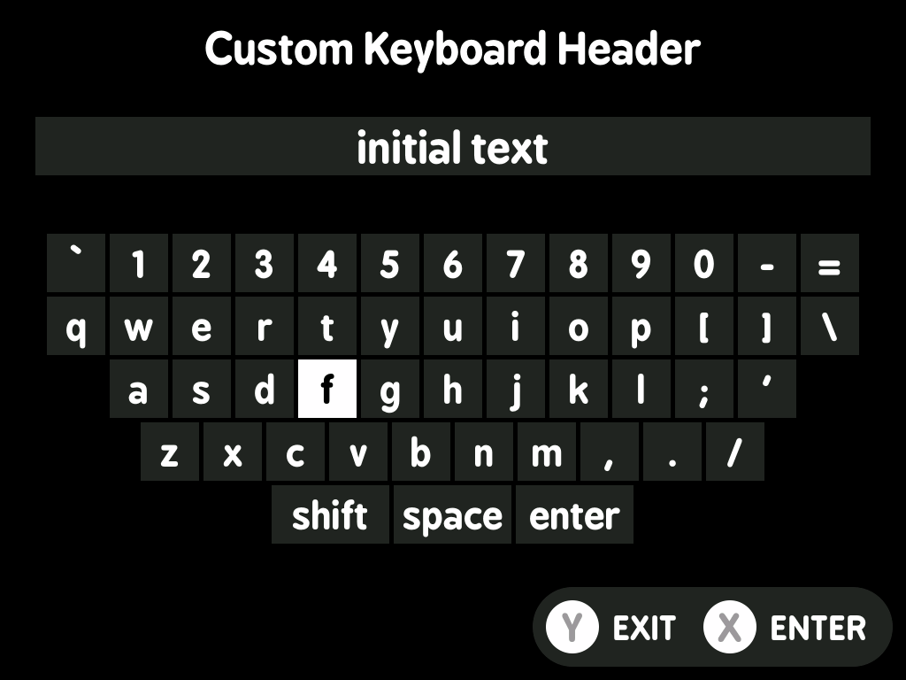
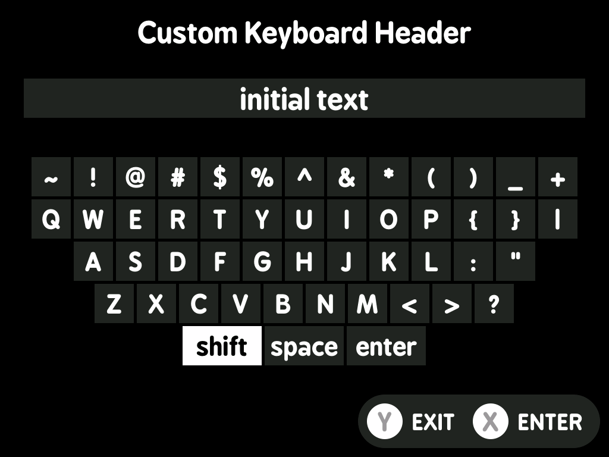

# minui keyboard

This is a minui keyboard. It allows people to type values into a text field and then writes that to stdout or a file.

## Requirements

- A minui union toolchain
- Docker (this folder is assumed to be the contents of the toolchain workspace directory)
- `make`

## Building

- todo: this is built inside-out. Ideally you can clone this into the MinUI workspace directory and build from there under each toolchain, but instead it gets cloned _into_ a toolchain workspace directory and built from there.

## Usage

This tool is designed to be used as part of a larger minui app. It only supports an english keyboard layout, and has support for capitalized keys as well as many common special characters.

```shell
# default behavior is to write to stdout
minui-keyboard

# write to a file
minui-keyboard > output.txt

# capture output to a variable for use in a shell script
output=$(minui-keyboard)

# specify a title for the keyboard page
# by default, the title is empty
minui-keyboard --title "Some Header"

# hide the wifi and battery icons
# by default, the hardware group is not shown
minui-keyboard --show-hardware-group

# specify an initial value for the text field
minui-keyboard --initial-value "Some Initial Value"
```

### Exit Codes

- 0: Success
- 1: Error
- 2: User cancelled with Y button
- 3: User cancelled with Menu button
- 130: Ctrl+C

## Screenshots

  
