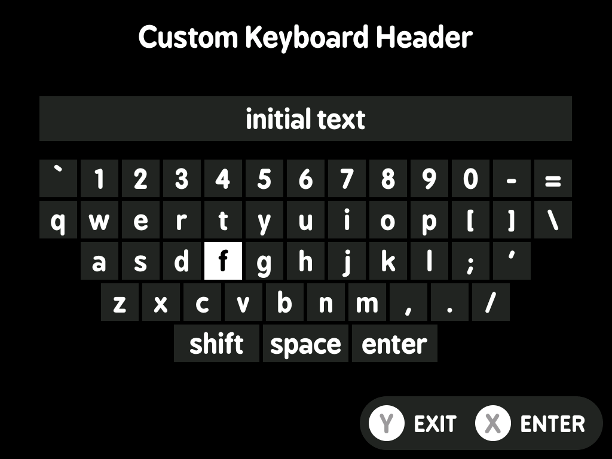
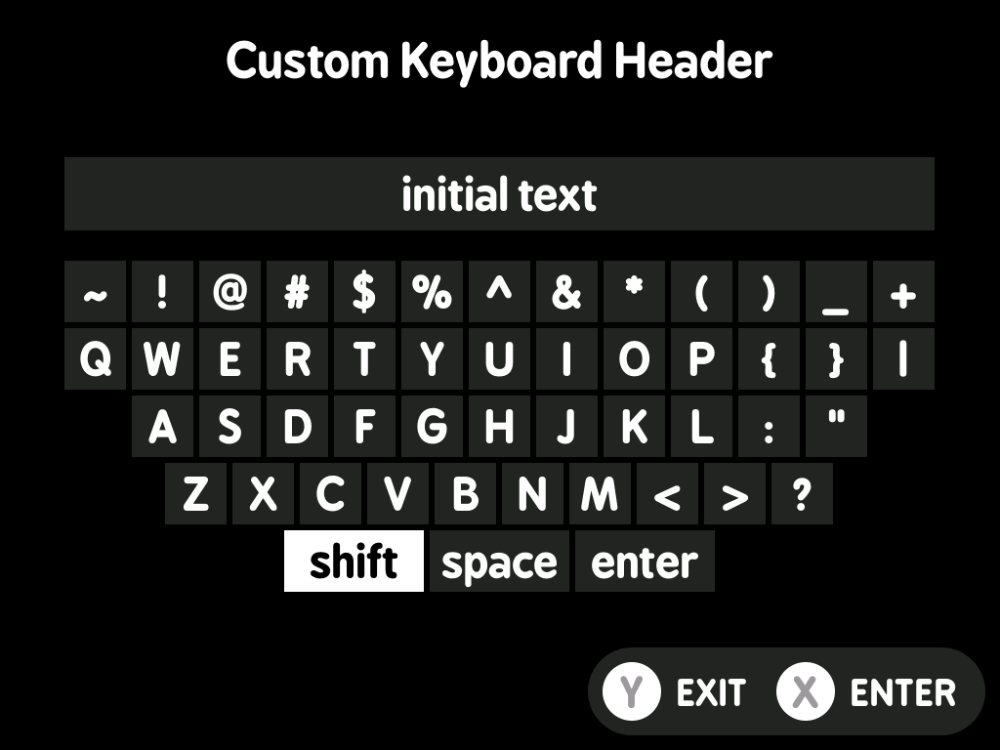
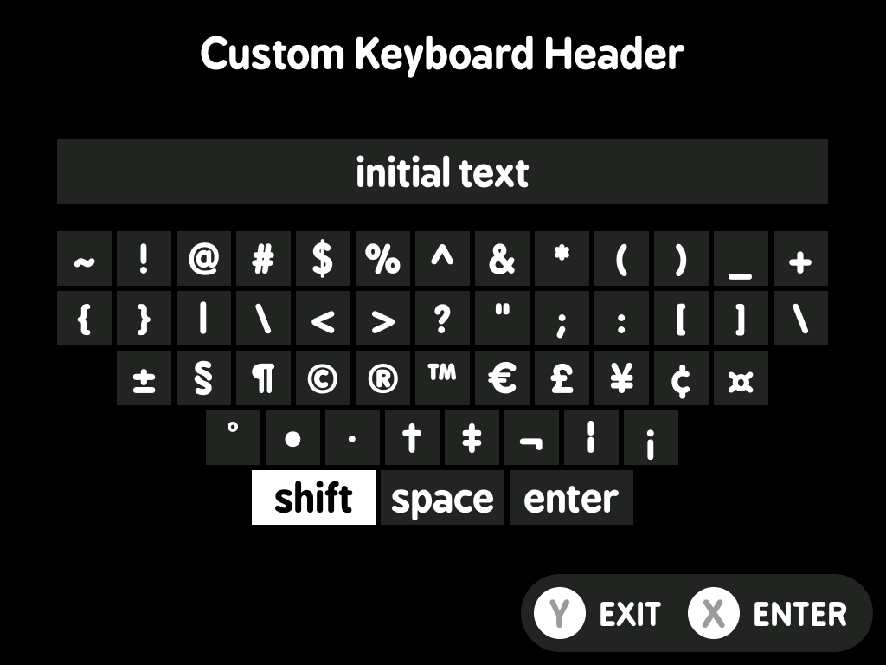

# minui keyboard

This is a minui keyboard. It allows people to type values into a text field and then writes that to stdout or a file.

## Requirements

- A minui union toolchain
- Docker (this folder is assumed to be the contents of the toolchain workspace directory)
- `make`

## Building

- todo: this is built inside-out. Ideally you can clone this into the MinUI workspace directory and build from there under each toolchain, but instead it gets cloned _into_ a toolchain workspace directory and built from there.

The build platform is selected with `PLATFORM`, and the binary is named `minui-keyboard-$(PLATFORM)`. For example, `PLATFORM=tg5040 make` produces `minui-keyboard-tg5040`.

## Supported platforms

Binaries are built against one of two firmwares. Most devices build against MinUI (`shauninman/MinUI`). NextUI-specific binaries build against a NextUI toolchain and are suffixed with `-nextui`.

- `tg5040` and `my355` run both firmwares, so they have a MinUI build (`minui-keyboard-tg5040`, `minui-keyboard-my355`) and a NextUI build (`minui-keyboard-tg5040-nextui`, `minui-keyboard-my355-nextui`).
- `tg5050` and `h700` are NextUI-only and build as `minui-keyboard-tg5050-nextui` and `minui-keyboard-h700-nextui`.

The `-nextui` binaries honor the device's NextUI theme, re-coloring the keyboard from the user's chosen theme colors and font instead of the fixed MinUI greyscale palette.

To build a NextUI variant, use its platform id inside the matching toolchain, for example `PLATFORM=tg5040-nextui make`. See [docs/nextui.md](docs/nextui.md) for the platform/toolchain matrix, the theming details, and how the NextUI builds are wired. For the native macOS build, see [docs/macos.md](docs/macos.md).

## Usage

This tool is designed to be used as part of a larger minui app. It only supports an english keyboard layout, and has support for capitalized keys as well as many common special characters.

```shell
# default behavior is to write to stdout
minui-keyboard

# write to a file
minui-keyboard > output.txt

# capture output to a variable for use in a shell script
output=$(minui-keyboard)

# you can also specify a location to write to
# the internal minui sdk sometimes writes to stdout
# depending on platform, so this may be useful
minui-keyboard --write-location file.txt

# specify a title for the keyboard page
# by default, the title is empty
minui-keyboard --title "Some Header"

# hide the wifi and battery icons
# by default, the hardware group is not shown
minui-keyboard --show-hardware-group

# specify an initial value for the text field
minui-keyboard --initial-value "Some Initial Value"

# minui-keyboard will auto-sleep like the normal minui menu by default
# this can be disabled by setting the --disable-auto-sleep flag
minui-keyboard --disable-auto-sleep
```

### Exit Codes

- 0: Success
- 1: Error
- 2: User cancelled with Y button
- 3: User cancelled with Menu button
- 130: Ctrl+C

## Screenshots

  
